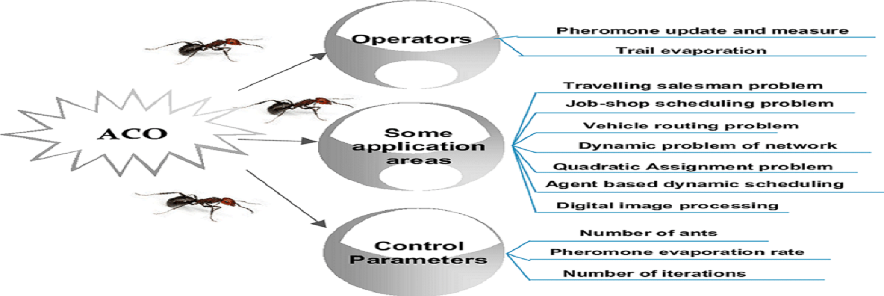

Project Name: Ant Colony Optimization
====

Start date : 08-11-2018

## Synopsis
The purpose of this project is to develop a software with a graphical interface
showing the dynamism of ant colony in their researches for food.

# Used Languages
* **Processing**
* **JAVA**

# Used Design Patterns
* **Composite**
* **Bridge**
* **Builder**
* **Facade**

# Design Patterns - TO BE INVOLVED
* **Prototype**

## Authors

* **Abdelmalik Ghoubir** <abdelmalik.ghoubir@ecole.ensicaen.fr>
* **Youssef Kaidi** <youssef.kaidi@ecole.ensicaen.fr>
* **Raphael Paulin** <raphael.paulin@ecole.ensicaen.fr>

## Team Leader

* **Abdelmalik Ghoubir** <abdelmalik.ghoubir@ecole.ensicaen.fr>

## Tutor

* **Alain LEBRET** <alain.lebret@ensicaen.fr>

## License

This Project is under MIT License.

## Acknowledgements

* Some useful lines of code may have been gotten from online forums and been adapted to the project purpose.
